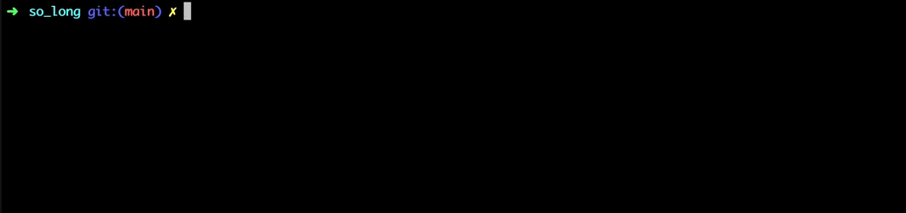

# So_long



## Table of Contents

- [Description](#description)
- [Bonus Part](#bonus-part)
- [Learning Resources](#learning-resources)
- [Related Projects](#related-projects)
- [Contact Information](#contact-information)

## Description

In this exciting 2D game, you take on the role of Jerry, a cunning mouse on a daring mission to escape the clutches of his arch-nemesis, Tom, the mischievous cat. Your objective is to navigate through a challenging map, collecting delicious cheeses scattered throughout the level while avoiding Tom's relentless pursuit. With smooth window management, responsive keyboard controls, and vibrant graphics, this game offers a thrilling adventure filled with strategy, agility, and a dash of humor. Help Jerry outsmart Tom and make a delicious escape in So Long!

## Bonus Part

The bonus part of So Long introduces a variety of exciting new features that enhance the overall gaming experience:
- **New Maps:** Explore a set of brand-new maps, each with unique layouts and challenges.
- **Enemy Patrols:** Encounter enemy patrols that can detect and pursue the player, adding an element of stealth and strategy to the game.
- **Sprite Animations:** Witness enhanced character and object animations, bringing life and fluidity to the game world.
- **On-Screen Movement Count:** Keep track of your progress with the movement count conveniently displayed on the screen.

With these exciting additions, the bonus part of So Long offers even more hours of engaging and rewarding gameplay.

## Usage

To build the project, run the following command in the project directory:

```
make
```

This will create the `so_long` executable.

To run the game, run the following command in the project directory, specifying the path to the map file as the first argument:

```
./so_long path/to/map.ber
```

For example, to run the game with the `map.ber` file in the `maps` directory, you would run the following command:

```
./so_long maps/map.ber
```

## Learning Resources

- [MiniLibX Documentation](https://harm-smits.github.io/42docs/libs/minilibx)
- [C Programming Tutorials](https://www.learn-c.org/)
- [Game Development Resources](https://gamemaker.io/fr/blog/slash-how-to-make-a-2d-game)

## Related Projects
[Cub3D](https://github.com/Ziko909/Cub3d): This project is inspired by the world-famous Wolfenstein 3D game

## Contact Information

- GitHub: [Ziko909](https://github.com/Ziko909)
- LinkedIn: [Zakaria Aabou](https://www.linkedin.com/in/zakaria-aabou)
- Gmail: aabou.zakaria909@gmail.com


